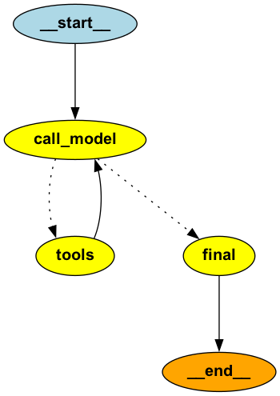

# Human in Loop implementation with LangGraph and Chainlit

### Graph




### How to run?
```sh
$ uv venv
$ uv sync
$ uv run chainlit run main.py -w
```

### Demo

[Human in Loop in LangGraph on YouTube](https://youtu.be/S_4fEMz9LRk?si=RqcEsCiD3ENhrvyb)